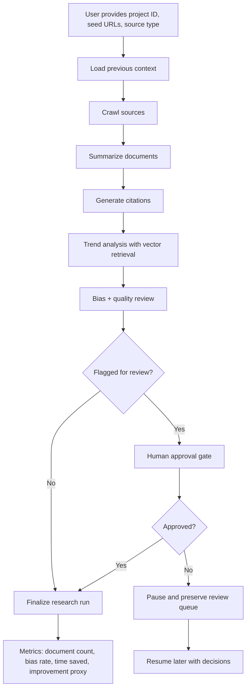

# Multi-Agent AI Research Copilot

A local-first multi-agent research assistant designed to turn scattered web sources into structured, cited, and reviewable research output. The system crawls source material, summarizes it, extracts citations, identifies trends with retrieval-augmented context, and applies bias and quality review before allowing a human approval gate.

## Problem Statement

Modern research workflows are fragmented and time-consuming:

- Researchers and analysts spend hours manually gathering, reading, and synthesizing sources.
- Source quality varies widely, and weak or biased material can slip into conclusions without detection.
- Context is often lost across sessions, making follow-up research inefficient.
- Most AI research tools depend on cloud infrastructure or centralized databases, which is not ideal for private, local, or offline workflows.

This project addresses that gap by building a research copilot that keeps work local, persistent, and transparent while still using multi-agent reasoning to improve quality.

## Why This Project Matters

This system is built around a practical research use case: helping teams move from browsing to evidence-backed insight without sacrificing trust or auditability.

Core goals:

- Reduce manual research time through automated crawling and summarization
- Capture and persist research context across runs
- Surface potential bias, quality issues, and confidence gaps early
- Use a retrieval layer to ground trend analysis in prior material
- Include a human approval step before finalizing outputs
- Run locally without a database server dependency

## Solution Overview

The project combines a lightweight local data layer, semantic retrieval, and a multi-stage LangGraph pipeline:

- Crawl and store source documents locally
- Summarize each source into concise evidence blocks
- Generate APA/MLA-ready citations
- Review for bias and source quality
- Reflect on the initial review for an extra round of analysis
- Detect evolving trends using retrieval-backed context
- Pause for human review when content is flagged
- Persist run state and context notes for continuation across sessions

## Architecture Workflow



## Key Features

- Local-only execution with no external database server required
- Persistent project memory across sessions
- Multi-agent reasoning flow orchestrated with LangGraph
- Vector-based retrieval to ground trend analysis in historical context
- Source review with bias scoring and quality flags
- Reflection-based validation to critique the initial review
- Human-in-the-loop approval gate for risky or flagged content
- Citation generation in APA and MLA styles
- JSON-driven LLM fallback behavior for reliable outputs

## Tech Stack

- Python 3.11+
- LangGraph for orchestration
- ChromaDB for local vector search
- Scrapy and BeautifulSoup for crawling and extraction
- Groq LLM APIs for summarization, review, and synthesis
- Pydantic for validation
- Local filesystem state storage for project memory

## Project Structure

```text
Multi-Agent-AI-Research/
├── README.md
├── pyproject.toml
├── research_copilot/
│   ├── __init__.py
│   ├── cli.py
│   ├── crawler.py
│   ├── llm.py
│   ├── pipeline.py
│   ├── store.py
│   ├── vector_store.py
│   ├── web.py
│   └── index.html
├── tests/
│   ├── test_acceptance.py
│   └── test_pipeline.py
└── research_copilot.egg-info/
```

## Example Usage

Run a research workflow from the command line:

```bash
research-copilot --project-id market-analysis --seed-url https://example.com --source-type web
```

Run with a human review gate:

```bash
research-copilot --project-id market-analysis --seed-url https://example.com --source-type web --human-review
```

Resume a paused workflow:

```bash
research-copilot --project-id market-analysis --resume --decision DOC_ID=approve
```

## Research Output Highlights

The pipeline produces outputs such as:

- Document summaries with confidence and key insights
- Citations in APA and MLA format
- Bias and quality verdicts
- Trend narratives informed by retrieved context
- Final project metrics including:
  - document count
  - time saved vs manual effort
  - bias detection rate
  - accuracy improvement proxy

## Why It Works

The system is intentionally designed around a simple principle: research quality improves when evidence is gathered, reviewed, and validated before being used to form conclusions. By combining retrieval, critique, and human review, it reduces the risk of shallow or misleading synthesis while still being practical for local use.

## Future Enhancements

- Multi-source domain expansion for academic, news, and financial research
- Better citation extraction from structured metadata
- Improved quality scoring with domain-specific heuristics
- UI dashboard for exploring results and decisions
- More advanced summarization and ranking strategies

## License

This project is intended for research and experimentation purposes and is suitable as a portfolio project demonstrating local AI orchestration, retrieval, and human-in-the-loop research workflows.
